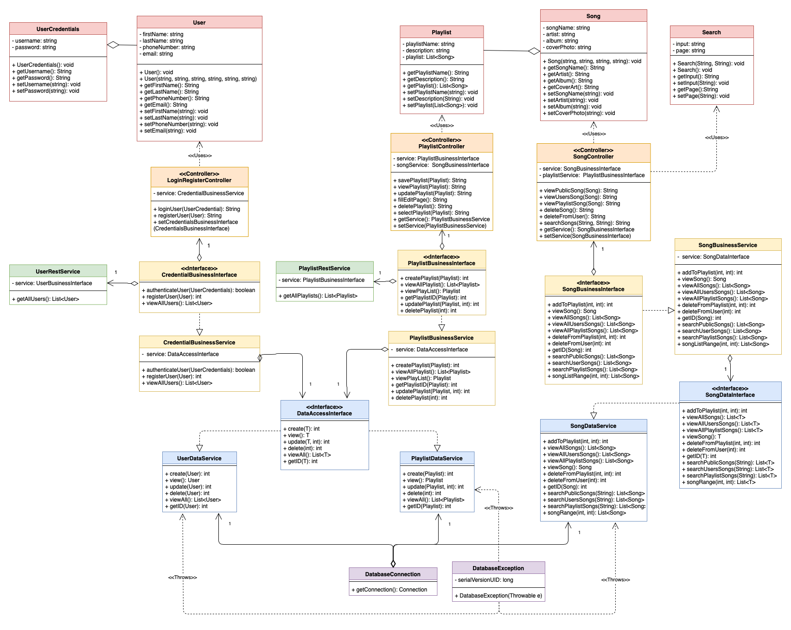
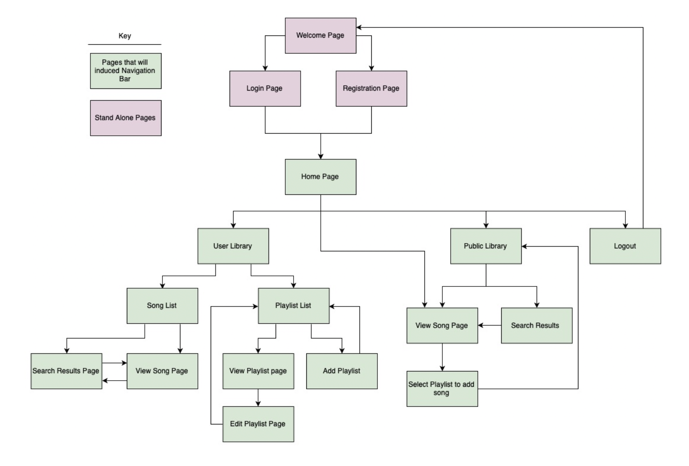
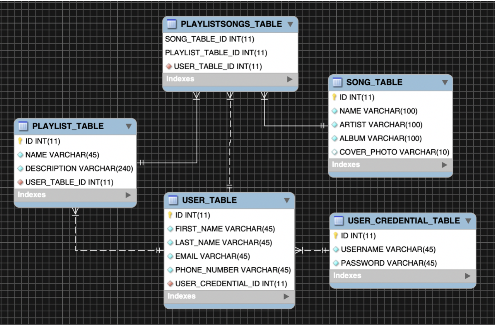
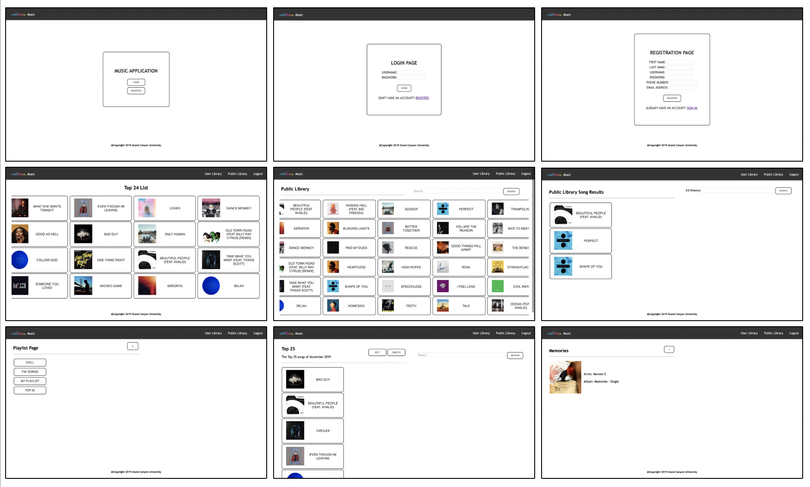
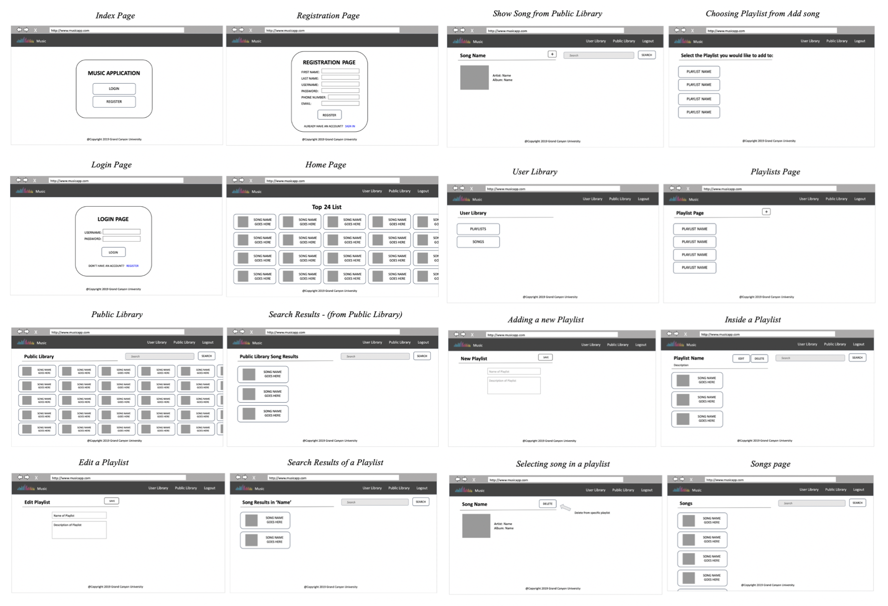

# Music Website

Using CodeReadyStudio, I created a music web application aiming to replicate the functionality of Spotify, that allows a user to login or register an account. Within their account, the user is able to create their own playlist(s) using add and delete functions, as well as the ability to edit playlist names and descriptions. The application has a public library, containing all of the songs in the database. These songs can be added and removed from specific playlists, and the combination of all of these songs create the user’s song library. The public library, user’s library, and each playlist can all be searched for specific songs. All necessary data for users, playlists, and song information was stored in a database using phpMyAdmin, and I used Java EE to make our application accessible on the localhost web.

The objective of this project was to  build a complete enterprise class N-Layer application that met the following requirements:

	1. User Login and Registration
	2. Separation of presentation, business, and data layers
	3. Include exception handling
	4. Perform CRUD operations on a product
	5. Utilize the MVC design pattern with JavaServer Faces
	6. Execute data validation on all entry fields
	7. Use a JSF Data Grid and Facelets
  	8. Connect to a database

<h2>Design</h2>

There were key design decisions that were implemented to make the web application more user friendly. These features included the ability to search for songs, all songs and playlists being alphabetically ordered, and having a delete confirmation popup.

The planning for this project included using tools such as UML diagrams to determine class relationships, wireframes to outline each layout, as well as sitemap for page navigation within the website. Below is the UML diagram and the sitemap used.

<h3>UML Diagram</h3>

	

	
<h3>Sitemap<h3>

	

<h2>Database</h2>

In order for this application to function properly, the use of a database was required. Within the database were tables for user's information, user's login credentials, playlists created, all of the songs in the public library, and a relation table that determined which songs were in each playlist. Below is an ER diagram that shows those connections.

<h3>ER Diagram<h3>

	

<h2>Final Product</h2>

The final product for this project was a fully functioning music website. Below are some of the completed pages.

<h3>Web Pages<h3>

	

<h3>Digital Wireframes<h3>

	

